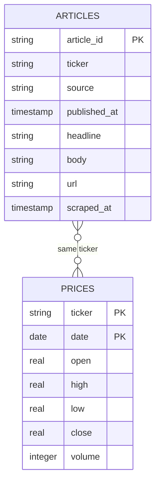

# Stock News Pipeline

A lightweight data pipeline that collects financial news and stock prices for a configurable set of tickers,
deduplicates the results, and stores everything in a local SQLite database for later analysis and modeling.

News is sourced from the [Alpha Vantage `NEWS_SENTIMENT`](https://www.alphavantage.co/documentation/#news-sentiment)
endpoint, which provides pre-computed per-article sentiment scores stored as a reference baseline. Prices are
sourced via [`yfinance`](https://github.com/ranaroussi/yfinance).

This is the data-foundation half of a two-project system. `stock-sentiment-strategy` consumes this pipeline's database
to do NLP modeling and strategy development. Keeping them separate means the DB schema here stays free of any derived
labels (direction, magnitude, volatility) - those are horizon-dependent decisions that belong downstream, not baked into
the data layer.

> **Status:** Core pipeline (schema, both scrapers, config, unified runner) is built and tested.
> No automated test suite yet - see [Known Issues & Roadmap](#known-issues--roadmap).

---

## Table of Contents

- [Features](#features)
- [Project Structure](#project-structure)
- [Getting Started](#getting-started)
- [How It Works](#how-it-works)
- [Data Model](#data-model-high-level)
- [Tech Stack](#tech-stack)
- [Known Issues & Roadmap](#known-issues--roadmap)
- [Development Notes](#development-notes)
- [License](#license)

---

## Features

- **News ingestion** - pulls the latest articles per ticker from Alpha Vantage, including headline, summary, source, URL, and reference sentiment score.
- **Price ingestion** - fetches daily OHLCV data per ticker via `yfinance`.
- **Deduplication** - stable article IDs derived from a SHA-256 hash of the article URL prevent duplicate rows across runs, even when the same article is tagged to multiple tickers.
- **SQLite storage** - everything persisted in a single portable `data/pipeline.db` file, created automatically on first use.
- **YAML configuration** - tickers, price date range, and news limit/pause settings live in `config/config.yaml` instead of being hardcoded.
- **`.env` secrets** - API keys stay out of the repo via `python-dotenv`.
- **Rate-limit aware** - built-in pause between ticker requests to respect the Alpha Vantage free tier (5 requests/minute).
- **Per-stage fault tolerance** - in the unified pipeline runner, a failure fetching prices doesn't prevent news from being fetched (and vice versa); each stage fails independently.


---

## Project Structure

```
stock-news-pipeline/
├── config/
│   └── config.yaml            # Tickers, price date range, news limit/pause settings
├── data/
│   └── pipeline.db            # SQLite database (generated on first run, gitignored)
├── scripts/
│   └── run_pipeline.py        # Entry point - runs prices then news, config-driven
├── src/
│   ├── db/
│   │   ├── connection.py      # get_connection(), upsert_articles(), upsert_prices()
│   │   └── schema.py          # Table definitions + init_db()
│   ├── scraping/
│   │   ├── fetch_news.py      # Alpha Vantage news ingestion
│   │   └── fetch_prices.py    # yfinance price ingestion
│   └── utils/
│       ├── config.py          # YAML config loader
│       └── dedupe.py          # Stable article ID hashing (SHA-256 of URL)
├── tests/                     # Reserved for an automated test suite (not yet written)
├── .env                       # Secrets (not committed)
├── .env.example               # Template for .env
├── .gitignore
├── requirements.txt
└── README.md
```

---

## Getting Started

1. **Prerequisites:**
   - Python 3.12+
   - `pip`
   - A free [Alpha Vantage API key](https://www.alphavantage.co/support/#api-key)

2. **Clone the repository and enter the project directory.**

3. **Create and activate a virtual environment.**

4. **Install dependencies:**
   ```bash
   pip install -r requirements.txt
   ```

5. **Create a `.env` file** in the project root (copy `.env.example`) and add your key:
   ```
   ALPHA_VANTAGE_API_KEY=your_key_here
   ```

6. **Edit `config/config.yaml`** to set your tickers, price date range, and news settings.

7. **Run the pipeline:**
   ```bash
   python -m scripts.run_pipeline
   ```
   There's no separate DB-initialization step to run first - `get_connection()` calls `init_db()`
   automatically the first time it's used, creating `data/pipeline.db` and its tables if they don't exist yet.

---

## How It Works

1. **Fetch** - `run_pipeline.py` calls `fetch_prices.py` (via `yfinance`) and `fetch_news.py` (via the Alpha
   Vantage `NEWS_SENTIMENT` endpoint) for each ticker in `config.yaml`.
2. **Parse** - each raw news article is normalized (ISO timestamps, extracted fields) into the shape the
   `articles` table expects; price bars are normalized similarly for the `prices` table.
3. **Dedupe** - a stable `article_id` is computed as a SHA-256 hash of the article's (lowercased, trimmed) URL,
   so re-running the pipeline won't create duplicate article rows, and the same article referenced under multiple
   tickers still resolves to one row.
4. **Upsert** - articles are inserted with `INSERT OR IGNORE` (duplicates silently skipped); prices are inserted
   with `INSERT OR REPLACE` (same `ticker`+`date` overwrites with fresher data rather than erroring).
5. **Throttle** - between ticker requests in `fetch_news.py`, the pipeline sleeps (default 12s, configurable via
   `pause_seconds` in `config.yaml`) to respect the Alpha Vantage free-tier rate limit.
6. **Fail independently** - if price fetching raises an exception (bad ticker, empty response, etc.),
   `run_pipeline.py` logs it and still proceeds to fetch news, and vice versa.

---

## Data Model
 
| Table      | Key                  | Columns                                                                                  |
|------------|----------------------|-------------------------------------------------------------------------------------------|
| `articles` | `article_id` (PK)    | `article_id`, `ticker`, `source`, `published_at`, `headline`, `body`, `url`, `scraped_at` |
| `prices`   | `(ticker, date)` (PK) | `ticker`, `date`, `open`, `high`, `low`, `close`, `volume`                                |
 

 
> Authoritative definitions live in `src/db/schema.py`. Deliberately absent: any derived/labeled columns
> (direction, magnitude, volatility). Those are horizon-dependent and belong in the downstream modeling project,
> keeping this DB reusable regardless of what prediction horizon gets chosen later.
 
---

## Tech Stack

- **Python 3.12**
- **yfinance** - price data
- **requests** - HTTP client for the Alpha Vantage API
- **python-dotenv** - loads secrets from `.env`
- **PyYAML** - configuration
- **pandas** / **numpy** - data wrangling in `fetch_prices.py`
- **SQLite** (via the standard library `sqlite3`) - storage

---

## Known Issues & Roadmap

**Known limitations**
- Alpha Vantage's free tier returns **HTTP 200 with a `Note`/`Information` message** instead of an error when
  you're rate-limited or over your daily quota. `fetch_news.py` detects this and raises a clear `RuntimeError`
  rather than silently storing nothing - but if you see that error, it means you've hit the quota, not that
  something is broken.
- Realized volatility (if computed downstream) over a 3-5 day window is a fairly small sample - noted here since
  it affects how any consumer of this DB should interpret short-horizon volatility estimates.

**Planned**
- Migration path to Postgres if scale ever demands it (not needed at current volume).
- Possible second news source, since Alpha Vantage's coverage is decent but not exhaustive.

---

## Development Notes

A few decisions worth calling out, since they shaped the design:

- **URL hashing over `ticker + time_published` for `article_id`:** the latter isn't actually unique - a single
  article is often tagged with multiple tickers (collapsing to different fake "duplicates"), and two different
  articles about the same ticker can publish in the same minute (a collision). Hashing the URL avoids both.
- **Upsert over plain insert:** re-running the pipeline is the normal case, not an edge case, so both scrapers are
  built assuming they'll be run repeatedly against overlapping date/article ranges.
- **`INSERT OR IGNORE` for articles vs. `INSERT OR REPLACE` for prices:** articles are treated as immutable once
  scraped (a duplicate is just noise to skip), while price bars for a given day can legitimately need to be
  overwritten (e.g., a corrected close price), so the two tables intentionally use different upsert semantics.
- **Per-stage fault tolerance in `run_pipeline.py`:** prices and news are fetched from entirely different APIs
  with different failure modes. Wrapping the whole run in one `try/except` would mean a single bad ticker or a
  yfinance hiccup blocks news from ever being attempted - so each stage is isolated instead.
- **Labels deliberately excluded from the schema:** direction/magnitude/volatility depend on a choice of
  prediction horizon, which is a modeling decision, not a data-collection one. Keeping the schema horizon-agnostic
  means `stock-sentiment-strategy` can experiment with different horizons without ever touching this project.
- **Config over hardcoding:** tickers, date ranges, and rate-limit settings live in `config.yaml` rather than in
  the scraper scripts themselves, since these are the values most likely to change between runs.

---

## License

MIT: see [LICENSE](LICENSE) for details.

## Sources Used

1. [Alpha Vantage News Sentiment API](https://www.alphavantage.co/documentation/#news-sentiment)
2. [yfinance](https://github.com/ranaroussi/yfinance)
3. [Browserless: Web Scraping Guide](https://www.browserless.io/blog/web-scraping-guide)

**Author:** Tanner Quigley